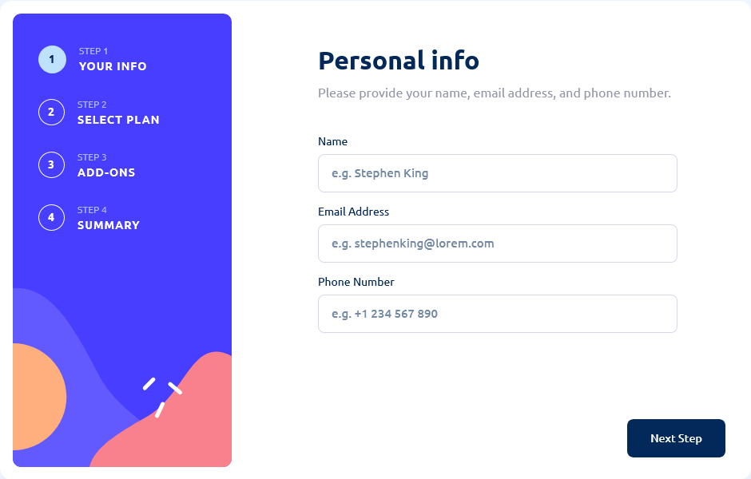

# Frontend Mentor - Multi-step form solution

This is a solution to the [Multi-step form challenge on Frontend Mentor](https://www.frontendmentor.io/challenges/multistep-form-YVAnSdqQBJ). Frontend Mentor challenges help you improve your coding skills by building realistic projects.

## Table of contents

- [Overview](#overview)
  - [The challenge](#the-challenge)
  - [Screenshot](#screenshot)
  - [Links](#links)
  - [Built with](#built-with)
  - [Author](#author)

**Note: Delete this note and update the table of contents based on what sections you keep.**

## Overview

### The challenge

Users should be able to:

- Complete each step of the sequence
- See a summary of their selections on the final step and confirm their order
- View the optimal layout for the interface depending on their device's screen size
- See hover and focus states for all interactive elements on the page

### Screenshot

### Links

- Solution URL: [Add solution URL here](https://your-solution-url.com)
- Live Site URL: [Add live site URL here](https://mtf-mobile-first.vercel.app/)

### Built with

- Mobile-first workflow
- [React](https://reactjs.org/) - JS library
- [react-hook-form](https://react-hook-form.com/) - Form Builder
- [yup](https://www.npmjs.com/package/yup) - Schema Builder
- [styled-components](https://styled-components.com/) - For styles
- [prop-types](https://www.npmjs.com/package/prop-types) - For props type

## Author

- Frontend Mentor - [@SwiichyCode](https://www.frontendmentor.io/profile/SwiichyCode)
- Twitter - [@SwiichyCode\_](https://twitter.com/SwiichyCode_)
